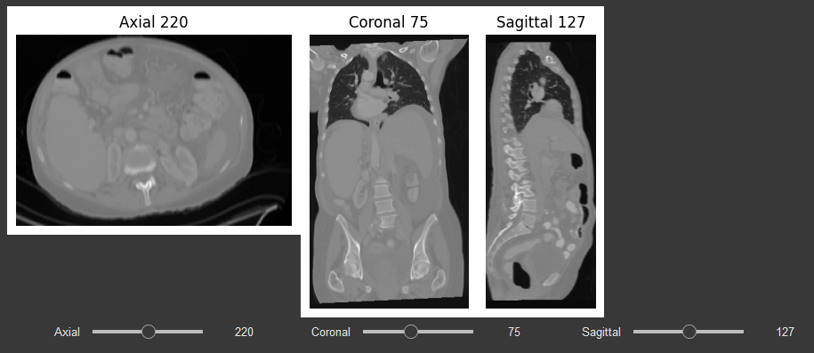
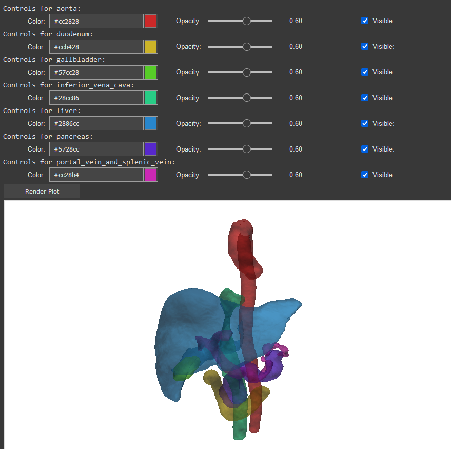
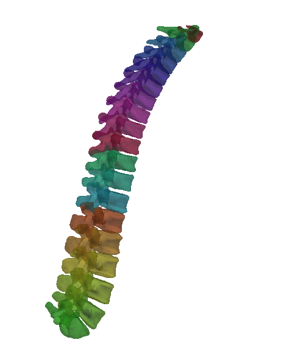
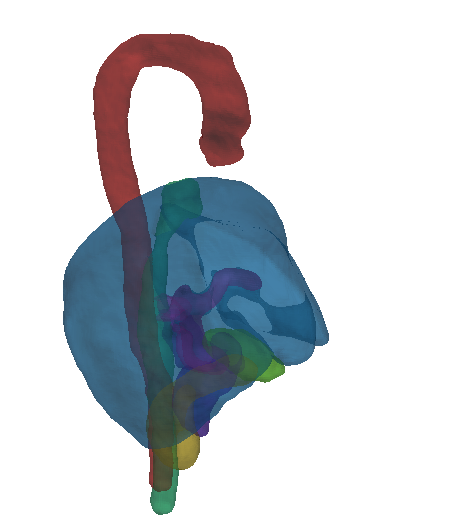
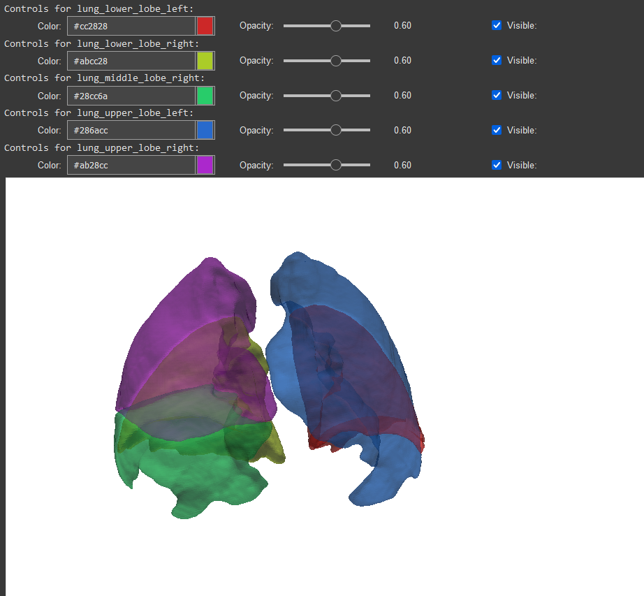

# MEDSEG
A medical segmentation and visualization utility notebook for comparing the results of 3 different AI models

<a target="_blank" href="https://colab.research.google.com/drive/1fbPTDlPnLo8WgzaxAVzAGZ7thVWc6hVa?usp=sharing">
  
</a>

### Brief
This project was created by Cairo University Systems and Biomedical Engineering students under the strict deadline of 2 weeks.
Its main goal is to accept CT input and return a segmentation of body organs using 3 different AI models as well as 3D visualization of the organs.
We were also asked to evaluate the 3 AI models' accuracy.

## How to use
Run the code blocks sequentially, giving input when asked to do so by widgets. **(This notebook is intended for use in a T4 GPU Runtime)**

The notebook comes with a sample of CT scans taken from [TotalSegmentator](https://github.com/wasserth/TotalSegmentator/)'s [CT Dataset](https://zenodo.org/records/10047292). that can be used for testing and evaulation.


## Features
1. CT image viewer for reviewing the scan before segmentation



2. Three Different AI models to choose from for inference
    - [TotalSegmentator](https://github.com/wasserth/TotalSegmentator/)
    - [MONAI SegResNet Whole Body CT Segmentation](https://monai.io/model-zoo.html#/model/wholeBody_ct_segmentation)
    - [STU-Net](https://github.com/uni-medical/STU-Net)
3. Accurate 3D visualization of segmented body parts with options for color, opacity, and visability.



4. Evaluation using multiple metrics
     - Dice Similarity Coefficient
     - Jaccard Index
     - Hausdorff Distance
5. Visualization and analysis of the results.


## Segmentation Comparison Results

| Organ | Dice (TS) | Dice (MONAI) | Dice (STU) | Jaccard (TS) | Jaccard (MONAI) | Jaccard (STU) | Hausdorff (TS) | Hausdorff (MONAI) | Hausdorff (STU) |
|:-----------------------------|------------:|---------------:|-------------:|---------------:|------------------:|----------------:|-----------------:|--------------------:|------------------:|
| aorta                        |       0.988 |          0.957 |        0.259 |          0.976 |             0.917 |           0.149 |            2.236 |               2.828 |           129.012 |
| autochthon_left              |       0.983 |          0.950 |        0.464 |          0.967 |             0.904 |           0.302 |            2.000 |               3.000 |            34.015 |
| autochthon_right             |       0.983 |          0.956 |        0.066 |          0.966 |             0.916 |           0.034 |            2.000 |               3.000 |            64.892 |
| colon                        |       0.939 |          0.892 |        0.823 |          0.885 |             0.805 |           0.700 |           25.962 |              32.265 |            35.299 |
| duodenum                     |       0.942 |          0.863 |        0.069 |          0.890 |             0.759 |           0.036 |            3.742 |              20.224 |            60.514 |
| esophagus                    |       0.958 |          0.872 |        0.176 |          0.920 |             0.773 |           0.096 |            2.000 |               4.359 |            50.299 |
| femur_left                   |       0.991 |          0.955 |        0.434 |          0.982 |             0.914 |           0.277 |            2.000 |               3.317 |           142.555 |
| femur_right                  |       0.991 |          0.963 |        0.063 |          0.982 |             0.929 |           0.033 |            1.414 |               3.000 |           140.132 |
| gluteus_maximus_left         |       0.981 |          0.948 |        0.535 |          0.963 |             0.902 |           0.365 |            2.828 |               8.124 |           126.779 |
| gluteus_maximus_right        |       0.982 |          0.951 |        0.005 |          0.964 |             0.907 |           0.003 |            2.236 |               5.000 |           128.117 |
| gluteus_medius_left          |       0.984 |          0.953 |        0.352 |          0.969 |             0.911 |           0.213 |            1.414 |               3.317 |           132.970 |
| gluteus_medius_right         |       0.983 |          0.934 |        0.064 |          0.966 |             0.876 |           0.033 |            1.414 |               5.745 |            53.526 |
| hip_left                     |       0.992 |          0.975 |        0.401 |          0.983 |             0.950 |           0.251 |           32.202 |               3.000 |           123.851 |
| hip_right                    |       0.993 |          0.972 |        0.216 |          0.986 |             0.945 |           0.121 |            2.000 |               3.000 |            82.904 |
| humerus_left                 |       0.965 |          0.929 |        0.642 |          0.933 |             0.868 |           0.473 |            2.449 |               2.236 |           182.945 |
| humerus_right                |       0.982 |          0.934 |        0.105 |          0.964 |             0.876 |           0.055 |            2.449 |               3.000 |            18.788 |
| iliac_artery_left            |       0.959 |          0.867 |        0.099 |          0.921 |             0.765 |           0.052 |            2.000 |              10.100 |            87.407 |
| iliac_artery_right           |       0.944 |          0.842 |        0.010 |          0.894 |             0.727 |           0.005 |            2.000 |               9.220 |            97.355 |
| iliac_vena_left              |       0.953 |          0.869 |        0.147 |          0.911 |             0.769 |           0.079 |            2.236 |              13.675 |            81.474 |
| iliopsoas_left               |       0.974 |          0.934 |        0.191 |          0.950 |             0.875 |           0.106 |            3.606 |               7.141 |           115.043 |
| iliopsoas_right              |       0.978 |          0.933 |        0.006 |          0.957 |             0.875 |           0.003 |            2.236 |               6.083 |           167.756 |
| kidney_left                  |       0.966 |          0.948 |        0.450 |          0.934 |             0.901 |           0.290 |            4.000 |               3.742 |            73.007 |
| kidney_right                 |       0.987 |          0.958 |        0.500 |          0.974 |             0.919 |           0.333 |            2.236 |              32.311 |            18.138 |
| liver                        |       0.992 |          0.978 |        0.608 |          0.983 |             0.957 |           0.437 |           31.765 |              35.972 |            74.760 |
| lung_lower_lobe_left         |       0.991 |          0.972 |        0.773 |          0.982 |             0.945 |           0.630 |            7.141 |              10.954 |            90.670 |
| lung_lower_lobe_right        |       0.990 |          0.977 |        0.271 |          0.981 |             0.954 |           0.157 |            2.828 |               7.280 |            55.579 |
| lung_middle_lobe_right       |       0.946 |          0.890 |        0.014 |          0.897 |             0.802 |           0.007 |           41.785 |              38.639 |            92.569 |
| lung_upper_lobe_left         |       0.995 |          0.986 |        0.552 |          0.990 |             0.973 |           0.381 |            3.606 |               4.472 |           113.860 |
| lung_upper_lobe_right        |       0.983 |          0.968 |        0.017 |          0.966 |             0.937 |           0.008 |           32.711 |              24.880 |            56.232 |
| pancreas                     |       0.932 |          0.891 |        0.280 |          0.872 |             0.804 |           0.163 |            9.695 |               6.403 |            17.205 |
| portal_vein_and_splenic_vein |       0.889 |          0.826 |        0.080 |          0.800 |             0.703 |           0.042 |           21.190 |              22.913 |            35.114 |
| rib_left_10                  |       0.980 |          0.885 |        0.377 |          0.961 |             0.794 |           0.232 |            1.000 |              27.586 |           109.197 |
| rib_left_11                  |       0.978 |          0.930 |        0.575 |          0.958 |             0.868 |           0.403 |            1.000 |               1.414 |            94.721 |
| rib_left_12                  |       0.875 |          0.820 |        0.662 |          0.777 |             0.695 |           0.494 |            4.690 |               3.742 |             9.434 |
| rib_left_3                   |       0.959 |          0.902 |        0.322 |          0.921 |             0.822 |           0.192 |            4.472 |               4.690 |           110.440 |
| rib_left_4                   |       0.972 |          0.866 |        0.209 |          0.946 |             0.763 |           0.116 |            1.732 |              30.757 |           129.391 |
| rib_left_5                   |       0.975 |          0.843 |        0.052 |          0.951 |             0.728 |           0.027 |            2.000 |              18.708 |           107.689 |
| rib_left_6                   |       0.970 |          0.893 |        0.000 |          0.942 |             0.807 |           0.000 |            2.449 |              20.347 |           131.015 |
| rib_left_7                   |       0.985 |          0.910 |        0.077 |          0.970 |             0.835 |           0.040 |            1.000 |              24.062 |           108.314 |
| rib_left_8                   |       0.985 |          0.949 |        0.162 |          0.970 |             0.902 |           0.088 |            2.236 |               2.236 |            93.670 |
| rib_left_9                   |       0.981 |          0.897 |        0.156 |          0.962 |             0.813 |           0.085 |            2.449 |               4.243 |            99.242 |
| sacrum                       |       0.978 |          0.833 |        0.408 |          0.957 |             0.714 |           0.256 |            7.280 |              15.000 |            80.529 |
| scapula_left                 |       0.979 |          0.940 |        0.587 |          0.960 |             0.888 |           0.415 |            3.317 |              29.816 |           127.785 |
| scapula_right                |       0.978 |          0.941 |        0.016 |          0.957 |             0.889 |           0.008 |            1.414 |               6.633 |            78.243 |
| small_bowel                  |       0.939 |          0.882 |        0.801 |          0.885 |             0.789 |           0.668 |           28.583 |              28.390 |            47.021 |
| spleen                       |       0.987 |          0.976 |        0.307 |          0.974 |             0.953 |           0.181 |            4.690 |               5.385 |            63.569 |
| stomach                      |       0.961 |          0.901 |        0.126 |          0.925 |             0.820 |           0.067 |           28.636 |              50.843 |            49.082 |
| trachea                      |       0.979 |          0.939 |        0.774 |          0.959 |             0.886 |           0.632 |            4.123 |               4.000 |            22.494 |
| urinary_bladder              |       0.943 |          0.924 |        0.428 |          0.891 |             0.858 |           0.272 |           12.728 |               7.280 |           103.252 |
| vertebrae_L5                 |       0.990 |          0.947 |        0.000 |          0.980 |             0.899 |           0.000 |            1.414 |               9.487 |            37.550 |
| vertebrae_T4                 |       0.989 |          0.894 |        0.000 |          0.978 |             0.809 |           0.000 |            1.000 |               7.141 |            50.853 |
| vertebrae_T6                 |       0.989 |          0.930 |        0.000 |          0.977 |             0.869 |           0.000 |            1.000 |              72.284 |            42.532 |
| vertebrae_T7                 |       0.988 |          0.941 |        0.040 |          0.976 |             0.889 |           0.021 |            1.000 |               3.464 |            31.591 |
| vertebrae_T8                 |       0.990 |          0.954 |        0.000 |          0.980 |             0.912 |           0.000 |            1.000 |               2.449 |            45.706 |

## Preview Images





## Acknowledgements
- TotalSegmentator:
```
Wasserthal, J., Breit, H.-C., Meyer, M.T., Pradella, M., Hinck, D., Sauter, A.W., Heye, T., Boll, D., Cyriac, J., Yang, S., Bach, M., Segeroth, M., 2023. TotalSegmentator: Robust Segmentation of 104 Anatomic Structures in CT Images. Radiology: Artificial Intelligence. https://doi.org/10.1148/ryai.230024
```

- nnU-Net:
```
Isensee, F., Jaeger, P. F., Kohl, S. A., Petersen, J., & Maier-Hein, K. H. (2021). nnU-Net: a self-configuring 
method for deep learning-based biomedical image segmentation. Nature methods, 18(2), 203-211.
```

- STU-Net:
```
@misc{huang2023stunet,
      title={STU-Net: Scalable and Transferable Medical Image Segmentation Models Empowered by Large-Scale Supervised Pre-training}, 
      author={Ziyan Huang and Haoyu Wang and Zhongying Deng and Jin Ye and Yanzhou Su and Hui Sun and Junjun He and Yun Gu and Lixu Gu and Shaoting Zhang and Yu Qiao},
      year={2023},
      eprint={2304.06716},
      archivePrefix={arXiv},
      primaryClass={cs.CV}
}
```

- SegResNet:
```
Myronenko, A., Siddiquee, M.M.R., Yang, D., He, Y. and Xu, D., 2022. Automated head and neck tumor segmentation from 3D PET/CT. arXiv preprint arXiv:2209.10809.
```

- MONAI
```
Tang, Y., Gao, R., Lee, H.H., Han, S., Chen, Y., Gao, D., Nath, V., Bermudez, C., Savona, M.R., Abramson, R.G. and Bao, S., 2021. High-resolution 3D abdominal segmentation with random patch network fusion. Medical image analysis, 69, p.101894.
```
